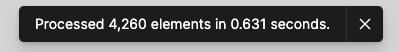
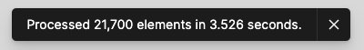

# The Inquisitor

"The Inquisitor" is the Figma plugin that helps you inspect local variables against the selected element(s) of currently loaded page.

It displays all collections and variables found in the file and identifies if the selected element(s) have any associations.

## Use cases

This plugin can be used for the following use cases:

- see all variables from the file
- identify not used variables
- identify "leaking" variables meant to be used in other pages
  - or failure to re-use 😉 (duplicate variables)

## Features

- display all local variables and collections used in the file
- indicates whether the variable is used in the selected element(s)
- supports variable filtering per collection
- auto-selects collection if its name matches the current page name
- displays select-and-check metrics
- variable check is performed against the bindings with
  - character
  - effects
  - fills
  - strokes
  - reactions

## Considerations

Considering this plugin works on the selection of elements, if a lot of elements gets selected ("Select All" Ctrl+A Cmd+A 👿) plugin may become unresponsive until selection and checks are performed. Obviously the number of variables will affect the execution time too.

On my MacBook Pro (Y2020, M1, 16GB RAM) I have not experienced crashes while inspecting over 100k elements, but it did took ~20 seconds to finish the task.

Process of selecting elements and running check is captured in Figma notification at the bottom of the screen once completed, so you can use it to gauge where's the safe zone for you and your machine.

Below are some examples I took while testing the file I worked with.

### Example 1



### Example 2



### Example 3


## Development

To run this project on your local machine

```bash
# clone the project
git clone https://github.com/Devgaze/figma-inquisitor.git
# or via SSH `git clone git@github.com:Devgaze/figma-inquisitor.git`

# dive into the folder and install dependencies
cd figma-inquisitor && npm install

# run the development server
npm run dev
```

To build the project

```bash
npm run build
```

To run linter and tests

```bash
npm run lint  # linter
npm run test  # test
# duh =p
```
